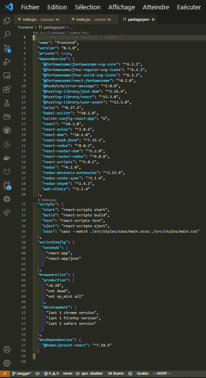

# Rakotonirina_JeanSebastien_13_03072022
## Openclassrooms P13 : Use an API for Bank user account with React
# Expected Skills :
- Implement a state manager in a React application
- Interact with an API (Application Programming Interfatce)
- Model an API
- Authenticate to an API

# Installation
1. git clone the repository
2. in each directory (fronten and backend), type npm install in vscode terminal console
3. follow instructions below

## 1. Backend in the directory named Project-10-Bank-API
Project #10 - Argent Bank API
This codebase contains the code needed to run the backend for Argent Bank.

Getting Started
Prerequisites
Argent Bank uses the following tech stack:

Node.js v12
MongoDB Community Server
Please make sure you have the right versions and download both packages. You can verify this by using the following commands in your terminal:

## Check Node.js version
node --version

## Check Mongo version
mongo --version
Instructions
Fork this repo
Clone the repo onto your computer
Open a terminal window in the cloned project
Run the following commands:
## Install dependencies
npm install

## Start local dev server
npm run dev:server

## Populate database with two users
npm run populate-db
Your server should now be running at http://locahost:27017 and you will now have two users in your MongoDB database!

Populated Database Data
Once you run the populate-db script, you should have two users in your database:

Tony Stark
First Name: Tony
Last Name: Stark
Email: tony@stark.com
Password: password123
Steve Rogers
First Name: Steve,
Last Name: Rogers,
Email: steve@rogers.com,
Password: password456
API Documentation
To learn more about how the API works, once you have started your local environment, you can visit: http://localhost:27017/api-docs

Design Assets
Static HTML and CSS has been created for most of the site and is located in: /designs.

For some of the dynamic features, like toggling user editing, there is a mock-up for it in /designs/wireframes/edit-user-name.png.

And for the API model that you will be proposing for transactitons, the wireframe can be found in /designs/wireframes/transactions.png.
## 2. Frontend
  In the frontend directory, type npm start to start the frontend app
  
# Implement a state manager in a React application
I use the Redux library, so according to the frontend package.json : 

  

    
  

